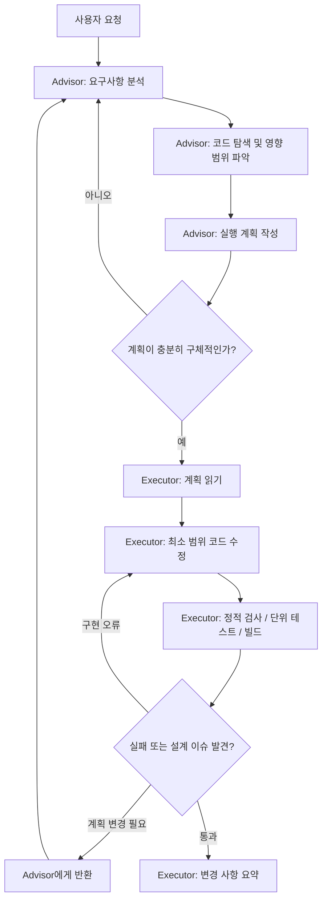

# Advisor Pattern 운영 가이드

## 목적

이 프로젝트에서는 모델의 역할을 분리한다.

- **중급 이상 모델(Advisor)**: 요구사항 분석, 실행 계획 수립, 설계 검토, 위험 요소 식별
  - Claude Sonnet
  - ChatGPT (Codex) 중간 이상
  - Gemini 3.5 Flash Medium 이상
- **저급 모델(Executor)**: 승인된 계획을 기준으로 실제 코드 작성 및 수정
- **브라우저 자동 실행 단계**: 사용하지 않음

핵심 원칙은 다음과 같다.

> 복잡한 판단은 Advisor가 수행하고, 반복적인 구현은 Executor가 수행한다.  
> Executor는 계획 없이 설계를 새로 결정하지 않는다.

---

## 역할 분리

| 구분 | Advisor (중급 이상 모델) | Executor (저급 모델) |
|---|---|---|
| 주 역할 | 문제 정의, 설계, 실행 계획 | 코드 구현, 파일 수정 |
| 모델 수준 | 중급 이상 | 저급 |
| 코드 직접 수정 | 원칙적으로 하지 않음 | 수행 |
| 설계 변경 권한 | 있음 | 없음 |
| 요구사항 해석 | 수행 | 계획 범위 안에서만 수행 |
| 테스트 전략 수립 | 수행 | 명령어 기반 검증만 수행 |
| 브라우저 실행 | 금지 | 금지 |

---

## 전체 작업 흐름



---

# 1. Advisor 운영 규칙

## Advisor의 책임

Advisor는 코드를 바로 작성하기 전에 다음을 수행한다.

1. 사용자 요구사항을 기능 단위로 분해한다.
2. 관련된 파일, 모듈, API, 데이터 흐름을 탐색한다.
3. 기존 구현 방식과 충돌할 수 있는 지점을 확인한다.
4. 구현 순서와 검증 방법을 포함한 실행 계획을 작성한다.
5. Executor가 추가 설계 판단 없이 구현할 수 있도록 충분히 구체화한다.

Advisor는 가능한 한 **무엇을 수정할지**, **왜 수정하는지**, **어떤 결과가 기대되는지**를 명확히 적는다.

---

## Advisor가 반드시 작성할 실행 계획 형식

Advisor는 아래 형식을 따른다.

```md
# 실행 계획

## 목표
- 해결하려는 사용자 문제:
- 완료 조건:

## 현재 구조 파악
- 관련 파일:
- 현재 동작:
- 변경이 필요한 이유:

## 수정 범위
1. `path/to/file`
   - 변경 목적:
   - 수정 내용:
   - 주의 사항:

2. `path/to/file`
   - 변경 목적:
   - 수정 내용:
   - 주의 사항:

## 구현 순서
1. ...
2. ...
3. ...

## 검증 방법
- 정적 검사:
- 단위 테스트:
- 통합 테스트:
- 빌드:
- 수동 확인이 필요하다면, 브라우저 대신 확인할 API / 로그 / CLI 명령:

## 위험 요소 및 롤백
- 위험 요소:
- 호환성 영향:
- 실패 시 되돌릴 파일 또는 변경:
```

---

## Advisor의 금지 사항

Advisor는 다음 행동을 하지 않는다.

- 계획 없이 여러 파일을 동시에 수정하지 않는다.
- 구현 세부사항을 Executor에게 모호하게 넘기지 않는다.
- “적절히 수정한다”, “필요한 부분을 변경한다”처럼 검증 불가능한 지시를 쓰지 않는다.
- 브라우저를 열거나, UI를 클릭하거나, 페이지 렌더링을 확인하는 단계를 계획에 넣지 않는다.
- 단순한 코드 변경에도 과도한 리팩터링을 포함하지 않는다.
- Executor가 추측해야 하는 빈칸을 남기지 않는다.

---

# 2. Executor 운영 규칙

## Executor의 책임

Executor는 Advisor가 작성한 실행 계획을 기준으로 코드만 구현한다.

Executor는 다음을 우선한다.

1. 계획에 명시된 파일과 범위 안에서 수정한다.
2. 기존 코드 스타일과 프로젝트 규칙을 유지한다.
3. 변경 범위를 최소화한다.
4. 구현 후 명령어 기반 검증을 수행한다.
5. 계획과 실제 코드가 충돌하면 임의로 설계를 바꾸지 않고 문제를 보고한다.

---

## Executor의 허용 작업

- 파일 생성, 수정, 삭제
- 타입 오류 수정
- 린트 실행
- 단위 테스트 실행
- 통합 테스트 실행
- 빌드 실행
- 포맷터 실행
- API 요청 기반 검증
- CLI 기반 검증
- 로그, 응답 코드, 테스트 결과 확인
- 테스트용 fixture 또는 mock 추가

---

## Executor의 금지 작업

Executor는 아래 행동을 절대 수행하지 않는다.

### 설계 및 범위 관련 금지

- Advisor 계획에 없는 아키텍처 변경
- 라이브러리 추가 또는 교체
- 데이터베이스 스키마 변경
- API 계약 변경
- 대규모 리팩터링
- 프로젝트 전반의 스타일 변경
- 요구사항을 새로 해석하여 기능 범위를 확대하는 행위

### 브라우저 및 UI 검증 관련 금지

아래 항목은 토큰 비용 절감을 위해 수행하지 않는다.

- 브라우저를 직접 실행하지 않는다.
- Playwright, Puppeteer, Selenium 등을 실행하지 않는다.
- 페이지를 열어 UI를 클릭하지 않는다.
- 스크린샷을 생성하거나 분석하지 않는다.
- DevTools를 열지 않는다.
- 브라우저 콘솔 로그를 확인하지 않는다.
- 시각적 렌더링 결과를 기반으로 테스트하지 않는다.
- E2E 브라우저 테스트를 신규 추가하거나 실행하지 않는다.

> UI 확인이 필요한 상황이라도 Executor는 브라우저를 사용하지 않는다.  
> 대신 빌드, 타입 검사, API 응답, 서버 로그, 단위 테스트, 컴포넌트 테스트 등으로 검증 가능한 범위까지만 확인한다.

---

## Executor가 막혔을 때의 처리 규칙

다음 상황에서는 구현을 멈추고 Advisor에게 반환한다.

- 계획에 없는 파일을 수정해야 하는 경우
- API 또는 DB 스키마 변경이 필요한 경우
- 요구사항이 서로 충돌하는 경우
- 기존 구조상 계획대로 구현할 수 없는 경우
- 보안, 데이터 손실, 인증/인가에 영향을 줄 수 있는 변경이 필요한 경우
- 테스트 실패 원인이 단순 구현 오류가 아니라 설계 문제로 보이는 경우

반환할 때는 아래 형식으로 보고한다.

```md
# Advisor 검토 요청

## 진행한 작업
- ...

## 막힌 지점
- ...

## 계획과 충돌한 내용
- ...

## 확인된 선택지
1. ...
2. ...

## Advisor 판단이 필요한 사항
- ...
```

---

# 3. 브라우저 없는 검증 정책

## 기본 검증 우선순위

브라우저 기반 확인 대신 아래 순서로 검증한다.


| 검증 대상 | 권장 방법 | 브라우저 사용 여부 |
|---|---|---|
| TypeScript 타입 안정성 | `tsc --noEmit` | 사용 안 함 |
| 코드 품질 | ESLint / Formatter | 사용 안 함 |
| 비즈니스 로직 | Unit Test | 사용 안 함 |
| API 계층 | Integration Test / `curl` / HTTP client | 사용 안 함 |
| 프론트엔드 빌드 | `npm run build` | 사용 안 함 |
| 라우팅/응답 | 테스트 서버 + HTTP 요청 | 사용 안 함 |
| UI 렌더링 | 컴포넌트 테스트 가능 범위 | 사용 안 함 |
| 시각적 UI 확인 | 수행하지 않음 | 금지 |

---

## 프론트엔드 작업 시 대체 검증 방법

브라우저를 실행하지 않는 대신 아래를 사용한다.

### 정적 검사

```bash
npm run lint
npm run typecheck
npm run build
```

프로젝트 스크립트가 다르면 `package.json`의 실제 스크립트를 우선한다.

### 컴포넌트 수준 검증

가능한 경우 다음을 활용한다.

- 렌더링 함수의 반환값 검증
- props 입력에 따른 상태 변화 검증
- 이벤트 핸들러 호출 검증
- API 호출 mock 검증
- 조건부 렌더링 테스트
- 접근성 속성 및 텍스트 존재 여부 테스트

### 서버/API 기반 검증

프론트엔드가 호출하는 API는 브라우저 대신 HTTP 요청으로 확인한다.

```bash
curl -i http://localhost:8080/api/example
```

인증이 필요한 경우에는 테스트 토큰, mock, 테스트 전용 계정을 우선 사용한다.

---

# 4. 작업 요청 템플릿

아래 템플릿을 작업 시작 시 사용한다.

```md
당신은 Advisor 역할입니다.

이번 작업에서는 직접 코드를 작성하지 마세요.
먼저 저장소 구조와 관련 코드를 분석하고, Executor가 그대로 구현할 수 있는 구체적인 실행 계획만 작성하세요.

반드시 포함할 내용:
1. 목표와 완료 조건
2. 관련 파일 및 현재 동작
3. 파일별 변경 내용
4. 구현 순서
5. 명령어 기반 검증 방법
6. 위험 요소 및 롤백 방법

중요 제약:
- 브라우저를 실행하지 마세요.
- Playwright, Puppeteer, Selenium, 스크린샷, UI 클릭, 페이지 렌더링 검증을 포함하지 마세요.
- 계획에 없는 리팩터링이나 라이브러리 추가를 제안하지 마세요.
- 구현자가 설계를 추측하지 않도록 구체적으로 작성하세요.
```

Advisor가 계획을 작성한 다음에는 아래 템플릿으로 Executor를 실행한다.

```md
당신은 Executor 역할입니다.

아래 Advisor 실행 계획을 기준으로만 코드를 구현하세요.

작업 원칙:
1. 계획에 명시된 파일과 변경 범위 안에서만 수정합니다.
2. 계획에 없는 설계 변경, 의존성 추가, API 계약 변경, DB 스키마 변경은 하지 않습니다.
3. 계획이 불충분하거나 구조적 충돌이 있으면 임의로 해결하지 말고 Advisor 검토 요청 형식으로 반환합니다.
4. 변경 범위를 최소화하고 기존 프로젝트 스타일을 따릅니다.
5. 구현 후 가능한 범위에서 타입 검사, 린트, 테스트, 빌드를 수행합니다.
6. 브라우저를 절대 실행하지 않습니다.
7. Playwright, Puppeteer, Selenium, 스크린샷, DevTools, UI 클릭, 페이지 렌더링 확인을 절대 수행하지 않습니다.

최종 응답 형식:
- 수정한 파일
- 파일별 변경 요약
- 실행한 검증 명령과 결과
- 실행하지 못한 검증과 이유
- Advisor 검토가 필요한 사항(있는 경우만)

[Advisor 실행 계획]
```

---

# 5. 권장 토큰 절약 원칙

## Advisor

- 코드 전체를 읽기보다 요구사항과 관련된 경로부터 탐색한다.
- 계획은 상세하게 쓰되, 불필요한 배경 설명은 줄인다.
- 여러 대안을 길게 나열하지 않는다.
- 불확실한 지점만 선택지로 분리한다.
- 구현 코드 전체를 미리 생성하지 않는다.

## Executor

- 승인된 계획 외의 탐색을 최소화한다.
- 변경 전후의 필요한 파일만 읽는다.
- 테스트 실패 시 관련 로그만 확인한다.
- 브라우저, 스크린샷, E2E 도구를 사용하지 않는다.
- 단순한 검증에는 가장 저렴한 명령을 우선한다.

---

# 6. 완료 기준

작업은 다음 조건을 만족할 때 완료로 간주한다.

- [ ] Advisor가 구현 가능한 수준의 실행 계획을 작성했다.
- [ ] Executor가 계획 범위 내에서만 코드를 수정했다.
- [ ] 브라우저 또는 브라우저 자동화 도구를 실행하지 않았다.
- [ ] 타입 검사, 린트, 테스트, 빌드 중 가능한 검증을 수행했다.
- [ ] 실패한 검증 또는 미확인 영역을 명시했다.
- [ ] 설계 판단이 필요한 이슈는 Advisor에게 반환했다.
- [ ] 최종 변경 내역을 파일 단위로 요약했다.

---

# 7. 한 줄 운영 원칙

> **Advisor는 생각하고 계획한다. Executor는 계획대로 구현한다. 검증은 브라우저 없이 수행한다.**
